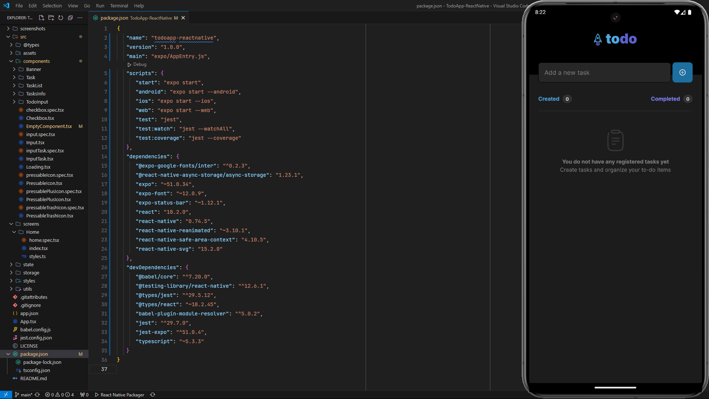

# Todo List App

A Todo List app built with React Native, utilizing Context API, `useReducer`, and AsyncStorage to manage and persist tasks. The layout was designed by [Rocketseat](https://www.rocketseat.com.br/) product designer [Milena Martins](https://www.linkedin.com/in/millenamartins/) for the level one challenge of the React Native training.

Check out a full video demonstration of the app in action: [YouTube - Todo App Demo](https://youtube.com/shorts/AiciqzxPlkY)

## Features

-  Add new tasks
-  Mark and unmark tasks as completed
-  Edit task descriptions
-  Delete tasks from the list
-  Sort tasks by their completion status
-  Display progress of task completion
-  Persist task data using AsyncStorage

## Architecture

The app is structured into several key components and modules, with state management provided via the Context API and `useReducer`. Task data is persisted locally using AsyncStorage to ensure that all changes remain even after the app is closed.

### Main Files

-  **TodoInput**: Handles the input for new tasks and dispatches the "added" action to update the global state.
-  **TaskList**: Renders the list of tasks using a `FlatList`. Handles task sorting and passes data to child components.
-  **TaskItem**: Manages individual task state, including editing, deleting, and marking tasks as completed.

-  **TasksContext**: Provides global state management for tasks. Uses `useEffect` to persist changes to AsyncStorage whenever the task list is modified.
-  **tasksReducer**: Defines the logic for handling various task actions, such as adding, updating, deleting, and completing tasks.

-  **App.tsx**: The entry point of the application, responsible for loading fonts and task data from AsyncStorage and passing them to the `TasksProvider`.

### Files Overview

-  **@types**: Global type definitions.
-  **assets**: Graphic resources for the app.
-  **components**:

   -  `Banner`: Displays the app's banner.
   -  `Task`: Manages and displays an individual task.
   -  `TaskList`: Displays the list of tasks.
   -  `TaskInfo`: Shows statistics about created and completed tasks.
   -  `TodoInput`: Handles adding new tasks.
   -  `Checkbox`: Changes appearance based on a boolean value.
   -  `EmptyComponent`: Displayed when the task list is empty.
   -  `Input`: A styled input field.
   -  `InputTask`: A styled input field for tasks.
   -  `Loading`: Shows a loading spinner.
   -  `PressablePencilIcon`: A pressable pencil icon for editing tasks.
   -  `PressablePlusIcon`: A pressable plus icon for adding tasks.
   -  `PressableTrashIcon`: A pressable trash icon for deleting tasks.

-  **screens**:

   -  `Home`: The main screen of the app.

-  **state**:

   -  `TasksContext`: Provides and manages the global state for tasks.
   -  `tasksReducer`: Contains the logic to manipulate the task list.
   -  `useTasks`: A hook to access the `TasksContext`.

-  **storage**:

   -  `tasksStorage`: Handles persisting task data on the device.

-  **styles**: Contains constants for colors and fonts.
-  **App.tsx**: The main entry point of the application.
